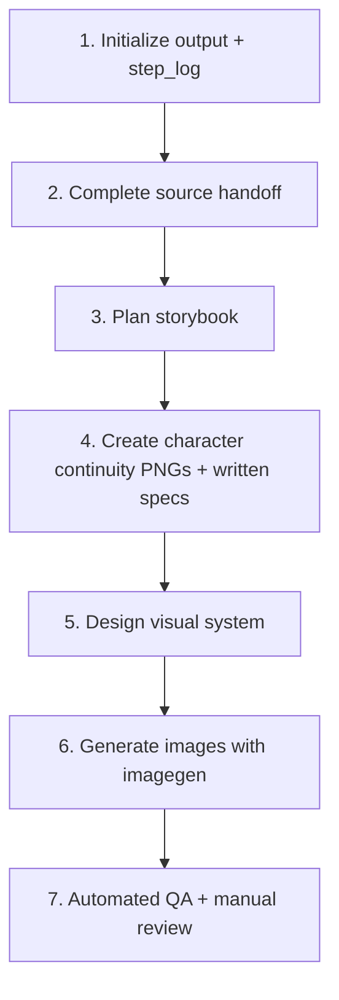

# Family Plant Picturebook Generator

A reusable Codex skill for turning source-backed plant information into consistent family picture books with imagegen-generated text and illustrations.

## Contents

- [What it does](#what-it-does)
- [Requirements](#requirements)
- [Install](#install)
- [Use](#use)
- [Workflow](#workflow)
- [Output](#output)
- [QA](#qa)
- [Reference assets](#reference-assets)
- [Repository layout](#repository-layout)

## What it does

- Converts a scientific plant dossier and child guide into a seven-page picture-book plan.
- Creates separate Qiqi and Mom continuity sheets with pose views and accessory-detail panels.
- Generates Chinese text and illustrations together through `imagegen`.
- Produces exact `1086 × 1448 px` (`3:4`) PNG pages.
- Keeps source files, prompts, references, production events, and QA results in one controlled book folder.

## Requirements

- Codex with the `imagegen` skill available.
- Node.js 18 or later.
- `shanghai-plant-guide-series` available when starting from a plant name only.
- Network access for the initial Git clones and `npm install`.

## Install

Clone both skills into the Codex skills directory and expose their actual skill folders:

```bash
mkdir -p ~/.codex/skills
cd ~/.codex/skills

git clone https://github.com/shiqian/shanghai-plant-guide.git shanghai-plant-guide-repo
git clone https://github.com/shiqian/family-plant-picturebook-generator.git family-plant-picturebook-generator-repo

ln -sfn ~/.codex/skills/shanghai-plant-guide-repo/shanghai-plant-guide-series \
  ~/.codex/skills/shanghai-plant-guide-series
ln -sfn ~/.codex/skills/family-plant-picturebook-generator-repo/family-plant-picturebook-generator \
  ~/.codex/skills/family-plant-picturebook-generator
```

Install the QA dependency:

```bash
cd ~/.codex/skills/family-plant-picturebook-generator-repo
npm install
```

## Use

Start a new Codex task and invoke the skill:

```text
Run $family-plant-picturebook-generator for 桂花.
```

For a plant name, the workflow first obtains the scientific dossier and child guide through `shanghai-plant-guide-series`. For supplied source files, it validates that both files are available before story or image work begins.

## Workflow



Source files are completed before story, character, visual, or image work. Every image-generation call identifies the purpose of each attached reference: character identity, outfit/accessory continuity, or series style and composition.

## Output

Each run creates exactly one book under `output/<plant-slug>/` at the repository root—the directory containing `package.json` and `README.md`:

```text
output/<plant-slug>/
├── continuity/
│   ├── qiqi-outfit-sheet.png
│   └── mom-outfit-sheet.png
├── source/
│   ├── scientific-dossier.md
│   └── child-guide.md
├── story_text.md
├── page_specs.json
├── step_log.md
├── final_pages/
└── qa_report.md
```

`step_log.md` is a compact append-only Markdown log. Final pages are PNG files at exactly `1086 × 1448 px` (`3:4`).

## QA

Run the single automated package check after all pages are generated:

```bash
cd ~/.codex/skills/family-plant-picturebook-generator-repo
npm run check:picturebook -- output/<plant-slug>/final_pages
```

Automated QA checks deterministic contracts: output structure, non-empty source files, production-log format, canonical continuity paths, readable reference assets, reference-purpose labels, page records, filenames, PNG format, and exact dimensions.

Manual QA checks text accuracy, typography, identity, outfit and accessory continuity, anatomy, style consistency, plant morphology, comparisons, safety wording, seasonal plausibility, and narrative flow.

## Reference assets

The bundled pages in [`assets/examples/series-reference/final_pages/`](family-plant-picturebook-generator/assets/examples/series-reference/final_pages/) are visual references only. Use them for series style, composition, typography, and visual density—not for plant facts or page copy.

The bundled identity asset is [`assets/characters/qiqi-and-mom-reference.png`](family-plant-picturebook-generator/assets/characters/qiqi-and-mom-reference.png). Per-book continuity sheets are generated inside each output folder.

## Repository layout

```text
.
├── README.md
├── package.json
├── package-lock.json
├── family-plant-picturebook-generator/
│   ├── SKILL.md
│   ├── agents/openai.yaml
│   ├── assets/
│   ├── references/
│   └── scripts/
└── .gitignore
```

## License

The skill, scripts, documentation, and bundled reference assets are released under the [MIT License](LICENSE).
