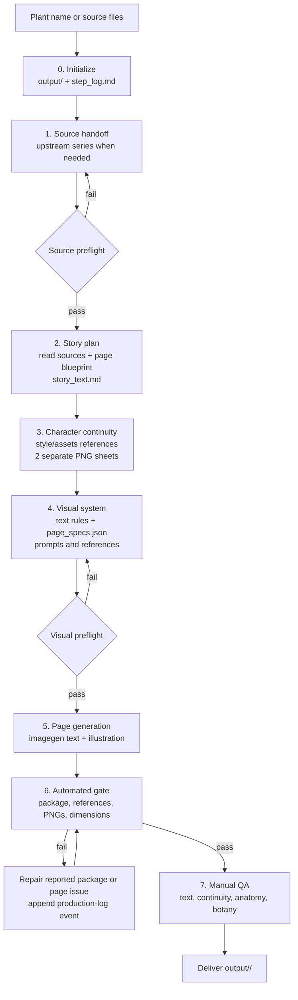

# Family Plant Picturebook Generator

A reusable Codex skill that turns source-backed plant information into a consistent family picture-book series.

It combines source control, story planning, per-character visual continuity, imagegen-integrated Chinese typography, automated package checks, and manual visual/factual QA for “七七的植物世界”-style parent-child botanical stories.

## Contents

- [What it provides](#what-it-provides)
- [Visual examples](#visual-examples)
- [Workflow](#workflow)
- [Inputs and dependencies](#inputs-and-dependencies)
- [Setup](#setup)
- [Output contract](#output-contract)
- [Quality assurance](#quality-assurance)
- [Repository layout](#repository-layout)

## What it provides

- Source-locked storytelling with no invented botanical facts
- A seven-page narrative system: cover, encounter, name, plant secret, close-up, comparison, and ending
- Two separate per-book character continuity PNGs for stable outfits, accessories, and poses
- Imagegen-generated text and illustration in the same page-generation call
- Canonical `1086 × 1448 px` portrait pages (`3:4`)
- Automated package, prompt-reference, asset, and dimension checks
- Manual review for text accuracy, character continuity, anatomy, visual quality, and botany

## Key contributions

- Designed an end-to-end source-to-delivery workflow for AI-generated botanical picture books, including upstream research handoff, story planning, visual design, generation, and QA gates.
- Built a reusable Codex skill with progressive-disclosure references, bundled visual assets, deterministic scripts, and structured production outputs.
- Implemented automated Node.js QA for source files, prompt references, continuity assets, PNG format, filename order, and exact `1086 × 1448 px` delivery dimensions.
- Established per-character visual continuity using separate Qiqi and Mom outfit-reference sheets to improve cross-page consistency.
- Defined an imagegen-first text-and-image workflow with complete-page redraws for content repairs and no post-production text overlays.
- Added append-only production logging to track actions, outputs, decisions, retries, risks, and automated checks.

## Visual examples

The bundled Erqiao Yulan pages demonstrate the intended warmth, typography feel, composition density, and parent-child storytelling rhythm. They are style references only, not factual sources for other plants.

<table>
  <tr>
    <th>Cover</th>
    <th>Botanical close-up</th>
    <th>Comparison</th>
  </tr>
  <tr>
    <td></td>
    <td></td>
    <td></td>
  </tr>
</table>

The bundled [`gou-shu`](family-plant-picturebook-generator/assets/examples/gou-shu/) package is a complete generated-book example containing source files, story plan, continuity sheets, page specifications, seven final pages, production log, and QA report.

## Workflow

The skill uses progressive disclosure: it loads only the references needed at each stage.



### Stage dependencies

1. Initialization creates the controlled output folder and the first production-log event.
2. Source handoff supplies `scientific-dossier.md` and `child-guide.md`; source preflight must pass before story or image work.
3. Story planning reads the source files, `page-blueprints.md`, and at least two sample pages from `assets/examples/erqiao-yulan/final_pages/`.
4. Character continuity uses the story context, style guide, asset guide, and bundled identity image to create one Qiqi sheet and one Mom sheet.
5. Visual planning uses the text rules, style guide, continuity references, and source-backed story to freeze `page_specs.json`.
6. Visual preflight must pass before final-page generation.
7. Every page is generated with image and required Chinese text together through `imagegen`.
8. Automated QA runs before manual QA; delivery requires both gates to pass.

## Inputs and dependencies

| Input | Handling |
|---|---|
| Plant name only | Run or request `shanghai-plant-guide-series` before research, drafting, or image generation. |
| Child-facing plant guide | Use as the narrative source; obtain the scientific dossier before delivery. |
| Complete scientific dossier | Use as factual authority; create or obtain the child-facing guide before delivery. |
| Optional user instructions | Apply only when they do not conflict with source facts or workflow gates. |

The final book package always requires both source files. Do not silently reconstruct a missing upstream stage from web research, an uncaptured chat response, or an example file.

The workflow depends on:

- Node.js 18 or newer;
- the `imagegen` skill for continuity sheets, final pages, and content repairs;
- `shanghai-plant-guide-series` when the input is only a plant name;
- the repository QA dependency `sharp` for PNG metadata and readability checks.

## Setup

From the repository root:

```bash
npm install
```

Expose `family-plant-picturebook-generator/` as a Codex skill or use it from this repository.

Example request:

```text
Run $family-plant-picturebook-generator for 桂花.
```

The normal skill workflow runs the lifecycle controls automatically. The commands are also available for development and troubleshooting:

```bash
npm run init:picturebook -- <plant-slug>
npm run preflight:source -- output/<plant-slug>
npm run preflight:visual -- output/<plant-slug>
```

## Output contract

Generated books live under the repository-level `output/` directory. Use a stable lowercase slug such as `yulan`, `guihua`, or `gou-shu`.

```text
output/<plant-slug>/
├── continuity/
│   ├── qiqi-outfit-sheet.png
│   └── mom-outfit-sheet.png
├── source/
│   ├── scientific-dossier.md
│   └── child-guide.md
├── story_text.md
├── page_specs.json
├── step_log.md
├── final_pages/
└── qa_report.md
```

`step_log.md` is the append-only English production log. Each event records a timestamp, actor, action, output, decision, and risk. Retries and user-requested revisions are appended as new events. See [`references/step-log.md`](family-plant-picturebook-generator/references/step-log.md) for the logging specification.

Do not create generated books in `out/`, ad-hoc folders, or the skill source directory. Draft or diagnostic files belong under `output/<plant-slug>/drafts/`.

## Quality assurance

During normal skill execution, Codex runs the automated gate and reads `qa_report.md` automatically. The gate checks:

- required source, story, log, continuity, and page-spec files;
- production-log structure and event validity;
- both continuity PNGs and the bundled identity reference;
- per-page prompt records, literal text, character declarations, and continuity references;
- final-page filename order and PNG format;
- exact `1086 × 1448 px` dimensions.

Manual QA remains required for:

- Chinese text accuracy and legibility;
- Qiqi and Mom identity, outfits, accessories, anatomy, and typography continuity;
- button count and placement when buttons are visible;
- plant morphology, comparison details, safety wording, and seasonal plausibility;
- page-role coverage, narrative flow, visual density, and overall series style.

Use these commands only to recheck an existing package, debug a failed generation, validate bundled assets, or support CI/development work:

```bash
npm run check:assets
npm run check:ratio -- output/<plant-slug>/final_pages
npm run check:picturebook -- output/<plant-slug>/final_pages
```

The final command writes `output/<plant-slug>/qa_report.md`. A package is deliverable only when automated QA and manual QA both pass.

## Repository layout

```text
.
├── README.md
├── package.json
├── package-lock.json
├── family-plant-picturebook-generator/
│   ├── SKILL.md
│   ├── agents/openai.yaml
│   ├── assets/
│   ├── references/
│   └── scripts/
└── .gitignore
```

The bundled assets and sample packages make the skill portable across projects. The canonical sample manifest is [`asset-manifest.json`](family-plant-picturebook-generator/assets/examples/erqiao-yulan/asset-manifest.json), and the complete generated-book example is [`gou-shu/`](family-plant-picturebook-generator/assets/examples/gou-shu/).
