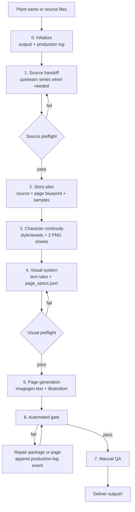

# Family Plant Picturebook Generator

A reusable Codex skill for turning source-backed plant information into consistent family picture books with imagegen-generated text and illustrations.

## Contents

- [Quick start](#quick-start)
- [What the skill does](#what-the-skill-does)
- [Workflow](#workflow)
- [Output](#output)
- [Inputs](#inputs)
- [Quality assurance](#quality-assurance)
- [Examples](#examples)
- [Key contributions](#key-contributions)

## Quick start

The generator uses `shanghai-plant-guide-series` when the user provides only a plant name. Clone both repositories directly under the user’s Codex skills directory.

### 1. Clone and expose both skills

These commands work on macOS and Linux. They keep the Git repositories under `~/.codex/skills/` and expose the actual skill directories where Codex can discover them.

```bash
mkdir -p ~/.codex/skills
cd ~/.codex/skills

git clone https://github.com/shiqian/shanghai-plant-guide.git \
  shanghai-plant-guide-repo
git clone https://github.com/shiqian/family-plant-picturebook-generator.git \
  family-plant-picturebook-generator-repo

ln -sfn ~/.codex/skills/shanghai-plant-guide-repo/shanghai-plant-guide-series \
  ~/.codex/skills/shanghai-plant-guide-series
ln -sfn ~/.codex/skills/family-plant-picturebook-generator-repo/family-plant-picturebook-generator \
  ~/.codex/skills/family-plant-picturebook-generator
```

Each exposed directory must contain a `SKILL.md` file:

```bash
test -f ~/.codex/skills/shanghai-plant-guide-series/SKILL.md
test -f ~/.codex/skills/family-plant-picturebook-generator/SKILL.md
```

If the repositories are already cloned, run `git pull` in each repository instead of cloning again. Copying the skill directories also works; symlinks make updates easier.

### 2. Install the generator dependency

```bash
cd ~/.codex/skills/family-plant-picturebook-generator-repo
npm install
```

The dependency is used by the deterministic PNG and picture-book QA scripts.

### 3. Run the skill

Start a new Codex task and request:

```text
Run $family-plant-picturebook-generator for 桂花.
```

For a plant name, the workflow obtains the scientific dossier and child guide through `shanghai-plant-guide-series` before story planning or image generation.

## What the skill does

- Creates source-backed seven-page botanical picture books without inventing plant facts.
- Generates two separate per-book continuity sheets: one for Qiqi and one for Mom, each with three pose views and an independent accessory detail panel.
- Generates Chinese text and illustrations together through `imagegen`.
- Delivers exact `1086 × 1448 px` (`3:4`) PNG pages.
- Produces a controlled package with source files, story text, page specifications, production history, final pages, and QA results.

## Workflow



The source dossier is the factual authority. The child guide supplies the narrative language. Text is generated inside the same imagegen call as the illustration, and failed content pages are redrawn as complete pages.

## Output

Generated books live under the repository-level `output/` directory:

```text
output/<plant-slug>/
├── continuity/
│   ├── qiqi-outfit-sheet.png
│   └── mom-outfit-sheet.png
├── source/
│   ├── scientific-dossier.md
│   └── child-guide.md
├── story_text.md
├── page_specs.json
├── step_log.md
├── final_pages/
└── qa_report.md
```

Use a stable lowercase slug such as `yulan`, `guihua`, or `gou-shu`. Keep drafts under `output/<plant-slug>/drafts/`; do not use `out/`, ad-hoc folders, or the skill source directory.

`step_log.md` is the append-only English production log. Each event records a timestamp, actor, action, output, decision, and risk. See [`references/step-log.md`](family-plant-picturebook-generator/references/step-log.md) for its specification.

## Inputs

| Input | Handling |
|---|---|
| Plant name only | Run or request `shanghai-plant-guide-series` first. |
| Child-facing plant guide | Use as narrative source; obtain the scientific dossier before delivery. |
| Complete scientific dossier | Use as factual authority; create or obtain the child-facing guide before delivery. |
| Optional user instructions | Apply only when they do not conflict with source facts or workflow gates. |

The final package always requires both source files. Do not reconstruct a missing upstream stage from web research, an uncaptured chat response, or an example file.

## Quality assurance

During normal execution, the skill runs source and visual preflights, the automated package gate, and manual QA.

Automated checks cover:

- required files and production-log structure;
- both continuity PNGs and the bundled identity reference;
- literal page text, prompt records, character declarations, continuity references, and written outfit locks;
- readable bundled style references on every page prompt;
- non-empty source files and complete page records, with seven pages unless an exception is documented;
- page order, PNG format, and exact `1086 × 1448 px` dimensions.

Manual QA covers text accuracy, character and outfit continuity, anatomy, button details, plant morphology, comparison details, safety wording, seasonal plausibility, and narrative flow.

Use these commands only for troubleshooting or development:

```bash
cd ~/.codex/skills/family-plant-picturebook-generator-repo
npm run check:assets
npm run check:ratio -- output/<plant-slug>/final_pages
npm run check:picturebook -- output/<plant-slug>/final_pages
```

## Examples

The bundled [Erqiao Yulan pages](family-plant-picturebook-generator/assets/examples/erqiao-yulan/final_pages/) demonstrate the intended warmth, typography, composition density, and parent-child storytelling rhythm. They are style references only, not factual sources for other plants.

<table>
  <tr>
    <th>Cover</th>
    <th>Botanical close-up</th>
    <th>Comparison</th>
  </tr>
  <tr>
    <td></td>
    <td></td>
    <td></td>
  </tr>
</table>

The bundled [`gou-shu` example](family-plant-picturebook-generator/assets/examples/gou-shu/) is a complete generated-book package with source files, continuity sheets, story plan, page specifications, seven final pages, production log, and QA report.

## Key contributions

- Designed an end-to-end source-to-delivery workflow for AI-generated botanical picture books.
- Built a reusable Codex skill with progressive-disclosure references, bundled assets, deterministic scripts, and structured outputs.
- Implemented automated Node.js QA for source files, prompt references, continuity assets, PNG format, filename order, and exact delivery dimensions.
- Established per-character visual continuity with separate Qiqi and Mom outfit-reference sheets.
- Defined an imagegen-first text-and-image workflow with complete-page redraws for content repairs.
- Added append-only production logging for actions, outputs, decisions, retries, risks, and automated checks.

## Repository layout

```text
.
├── README.md
├── package.json
├── package-lock.json
├── family-plant-picturebook-generator/
│   ├── SKILL.md
│   ├── agents/openai.yaml
│   ├── assets/
│   ├── references/
│   └── scripts/
└── .gitignore
```
