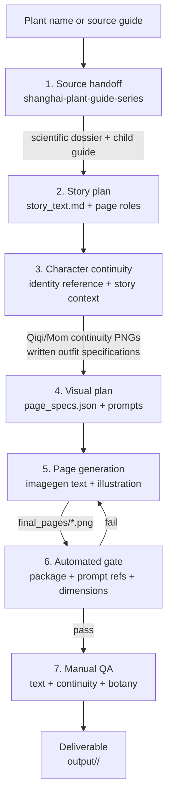

# Family Plant Picturebook Generator

A reusable Codex skill for turning source-backed plant information into a consistent seven-page family picture book.

It combines source control, story planning, character continuity, imagegen-integrated Chinese typography, and automated visual-package checks. The result is a repeatable production workflow for “七七的植物世界”-style parent-child botanical stories.

## Highlights

- Source-locked storytelling with no invented botanical facts
- Seven-page narrative system: cover, encounter, name, plant secret, close-up, comparison, and ending
- Two per-book character continuity PNGs for stable outfits, accessories, and poses
- Integrated text-and-image generation with `imagegen`
- Canonical `1086 × 1448 px` portrait pages (`3:4`)
- Automated package, prompt-reference, asset, and dimension checks plus manual visual/factual QA

## Visual sample

The bundled Erqiao Yulan pages demonstrate the intended warmth, typography feel, composition density, and parent-child storytelling rhythm. They are style references only, not factual sources for other plants.

<table>
  <tr>
    <th>Cover</th>
    <th>Botanical close-up</th>
    <th>Comparison</th>
  </tr>
  <tr>
    <td></td>
    <td></td>
    <td></td>
  </tr>
</table>

The bundled [`gou-shu`](family-plant-picturebook-generator/assets/examples/gou-shu/) package is a complete generated-book example. It includes the source dossiers, child guide, continuity sheets, story plan, page specifications, seven final pages, production log, and QA report, so it demonstrates the full output contract as well as the visual result.

## Workflow



The source dossier is the factual authority. The child guide supplies the narrative language. Story context determines the character outfits and pose references. Page text is generated together with the illustration; failed pages are redrawn as complete pages.

## Output structure

Generated books live under the repository-level `output/` directory:

```text
output/<plant-slug>/
├── continuity/
│   ├── qiqi-outfit-sheet.png
│   └── mom-outfit-sheet.png
├── source/
│   ├── scientific-dossier.md
│   └── child-guide.md
├── story_text.md
├── page_specs.json
├── step_log.md
├── final_pages/
└── qa_report.md
```

Use a stable lowercase slug such as `yulan`, `guihua`, or `gou-shu`. Draft files belong under `output/<plant-slug>/drafts/`; do not use `out/`, ad-hoc folders, or the skill source directory for generated books.

## Setup

1. Install Node.js 18 or newer.
2. Clone this repository and enter its root.
3. Install the QA dependency:

   ```bash
   npm install
   ```

4. Expose `family-plant-picturebook-generator/` as a Codex skill or use it from this repository.
5. Run the skill with a plant name or provide a completed scientific dossier and child guide.

For a plant name, the skill first requires the upstream `shanghai-plant-guide-series` source handoff.

## Optional standalone QA

During normal skill execution, Codex runs the automated gate and reads the resulting `qa_report.md` automatically. Use these commands only to recheck an existing output package, debug a failed generation, validate bundled assets, or support CI/development work.

```bash
node family-plant-picturebook-generator/scripts/check_skill_assets.js
node family-plant-picturebook-generator/scripts/check_png_ratio.js output/<plant-slug>/final_pages
node family-plant-picturebook-generator/scripts/check_picturebook_set.js output/<plant-slug>/final_pages
```

The final command writes `output/<plant-slug>/qa_report.md` and verifies the continuity specifications, both continuity PNGs, bundled identity reference, per-page prompt references, page order, PNG format, and exact `1086 × 1448 px` dimensions. Manual review is still required for text accuracy, readability, character continuity, anatomy, visual quality, and botanical correctness.

## Repository layout

```text
.
├── README.md
├── package.json
├── family-plant-picturebook-generator/
│   ├── SKILL.md
│   ├── agents/
│   ├── assets/
│   ├── references/
│   └── scripts/
└── .gitignore
```

The bundled assets and sample pages make the skill portable across projects. The canonical sample asset manifest is available at [`asset-manifest.json`](family-plant-picturebook-generator/assets/examples/erqiao-yulan/asset-manifest.json); the complete generated-book example is [`gou-shu/`](family-plant-picturebook-generator/assets/examples/gou-shu/).
