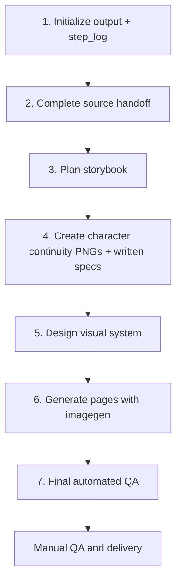

# Family Plant Picturebook Generator

A reusable Codex skill for turning source-backed plant information into consistent family picture books with imagegen-generated text and illustrations.

## Contents

- [Quick start](#quick-start)
- [Workflow](#workflow)
- [Output](#output)
- [QA](#qa)
- [References](#references)
- [Repository layout](#repository-layout)

## Quick start

Clone both skills into the Codex skills directory and expose their skill folders:

```bash
mkdir -p ~/.codex/skills
cd ~/.codex/skills

git clone https://github.com/shiqian/shanghai-plant-guide.git shanghai-plant-guide-repo
git clone https://github.com/shiqian/family-plant-picturebook-generator.git family-plant-picturebook-generator-repo

ln -sfn ~/.codex/skills/shanghai-plant-guide-repo/shanghai-plant-guide-series \
  ~/.codex/skills/shanghai-plant-guide-series
ln -sfn ~/.codex/skills/family-plant-picturebook-generator-repo/family-plant-picturebook-generator \
  ~/.codex/skills/family-plant-picturebook-generator
```

Install the deterministic QA dependency:

```bash
cd ~/.codex/skills/family-plant-picturebook-generator-repo
npm install
```

Start a new Codex task:

```text
Run $family-plant-picturebook-generator for 桂花.
```

With a plant name, the workflow obtains the scientific dossier and child guide through `shanghai-plant-guide-series` before story planning or image generation.

## Workflow



Source files are completed before story, character, visual, or image work. Every generated image uses `imagegen` and explicitly labels the purpose of each attached reference.

## Output

Generated books live under the repository-level `output/` directory:

```text
output/<plant-slug>/
├── continuity/
│   ├── qiqi-outfit-sheet.png
│   └── mom-outfit-sheet.png
├── source/
│   ├── scientific-dossier.md
│   └── child-guide.md
├── story_text.md
├── page_specs.json
├── step_log.md
├── final_pages/
└── qa_report.md
```

Final pages are PNG files at exactly `1086 × 1448 px` (`3:4`).

## QA

Run the single final automated check after all pages are generated:

```bash
cd ~/.codex/skills/family-plant-picturebook-generator-repo
npm run check:picturebook -- output/<plant-slug>/final_pages
```

The command checks deterministic package contracts: output structure, source files, production log, continuity assets, reference paths and purpose labels, page records, filenames, PNG format, and exact dimensions.

Manual QA checks text accuracy, typography, identity, outfits, accessories, anatomy, style continuity, plant morphology, comparisons, safety wording, seasonal plausibility, and narrative flow.

## References

The bundled pages under [`assets/examples/series-reference/final_pages/`](family-plant-picturebook-generator/assets/examples/series-reference/final_pages/) are visual references only. Use them for series style, composition, typography, and visual density—not for plant facts or page copy.

The identity asset is [`assets/characters/qiqi-and-mom-reference.png`](family-plant-picturebook-generator/assets/characters/qiqi-and-mom-reference.png). Per-book continuity sheets are created inside each generated book.

## Repository layout

```text
.
├── README.md
├── package.json
├── package-lock.json
├── family-plant-picturebook-generator/
│   ├── SKILL.md
│   ├── agents/openai.yaml
│   ├── assets/
│   ├── references/
│   └── scripts/
└── .gitignore
```
